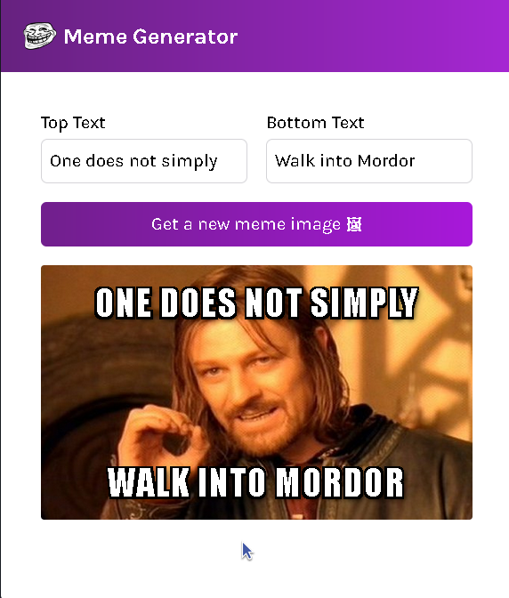

# Meme Generator

This is a simple Meme Generator application built with React. It allows users to generate memes by fetching random meme images from an API and adding custom text to them.


## Preview

 

## Getting Started

### Prerequisites

- Node.js and npm installed on your machine.

### Installation

1. Clone the repository:
    ```sh
    git clone https://github.com/hamawebdev/MemeGenerator
    cd MemeGenerator
    ```

2. Install the dependencies:
    ```sh
    npm install
    ```

### Running the Application

To start the development server, run:
```sh
npm start
```

This will start the Vite development server and open the application in your default web browser.


## Usage

1. Open the application in your web browser.
2. Enter the top and bottom text for your meme.
3. Click the "Get a new meme image 🖼" button to fetch a random meme image.
4. The generated meme will be displayed with the custom text.

## License

This project is licensed under the MIT License.
